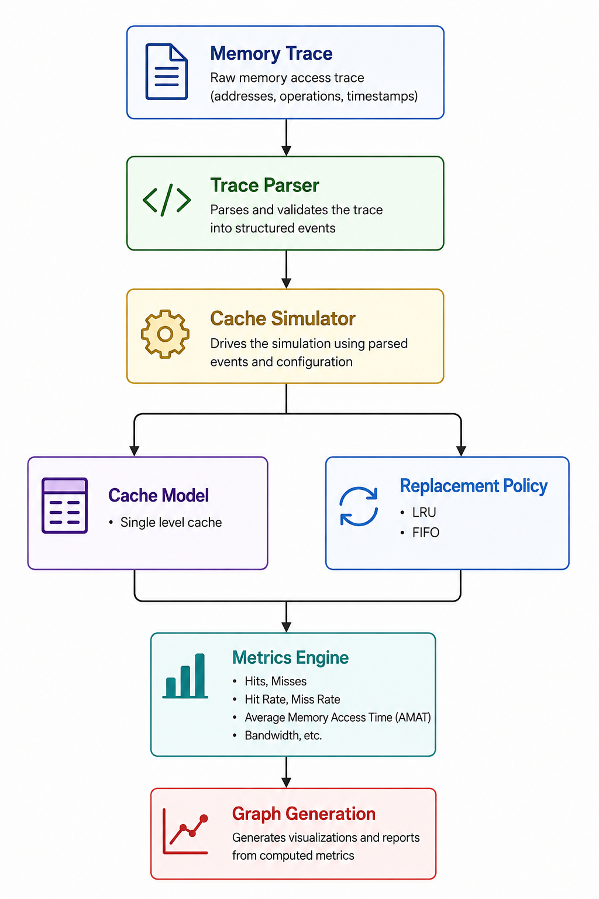
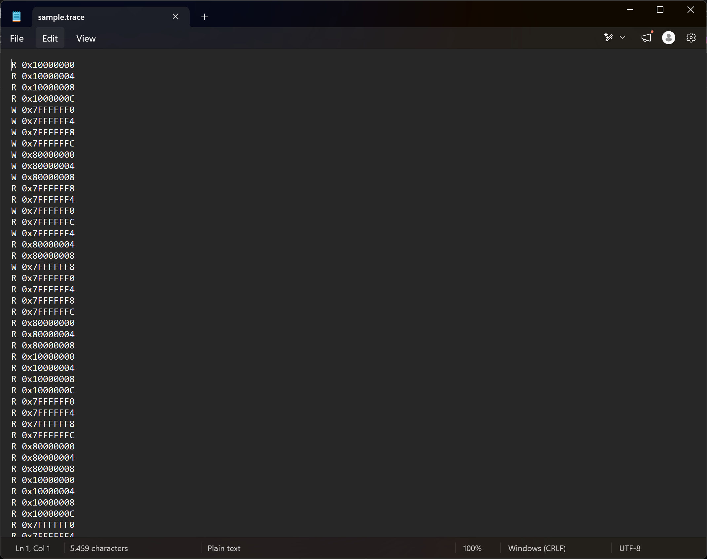
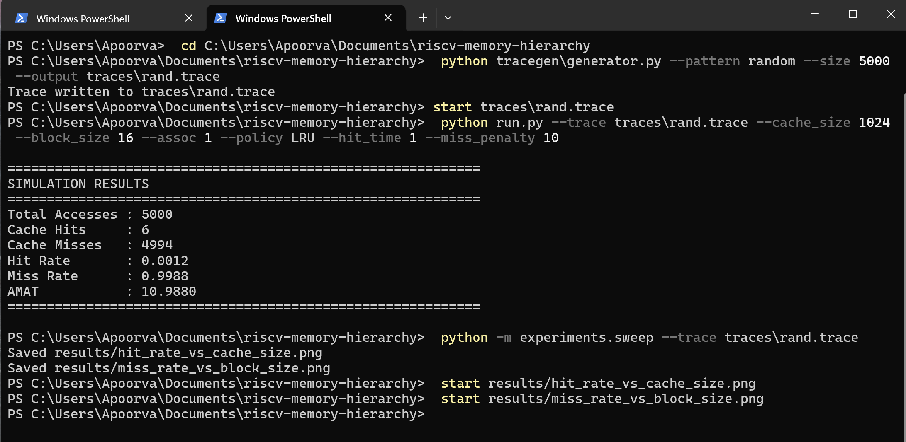
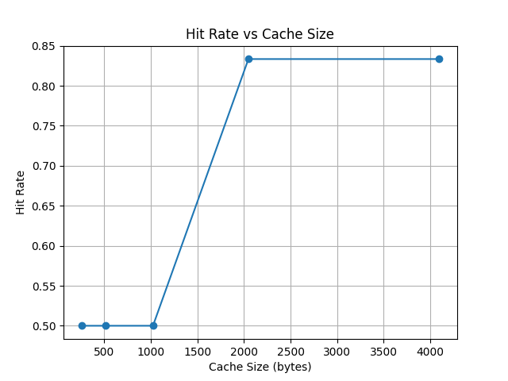
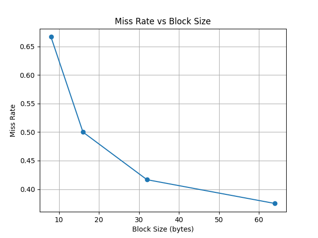

# RISC-V Memory Hierarchy Simulator

A trace-driven cache simulator for analyzing memory hierarchy performance using RISC-V memory access traces.

The simulator models different cache organizations and replacement policies, computes performance metrics such as hit rate, miss rate, and Average Memory Access Time (AMAT), and visualizes results through automatically generated graphs.

Developed as part of a Computer Organization and Architecture course project with an emphasis on cache design, performance evaluation, and modular software architecture.

---

## Features

### Cache Organizations

- Direct-Mapped Cache
- Set-Associative Cache (configurable associativity)
- Fully Associative Cache

### Replacement Policies

- Least Recently Used (LRU)
- First-In, First-Out (FIFO)

### Performance Metrics

- Total Memory Accesses
- Cache Hits
- Cache Misses
- Hit Rate
- Miss Rate
- Average Memory Access Time (AMAT)

### Experiment Automation

- Batch parameter sweep experiments
- Automatic performance comparison
- Graph generation using Matplotlib

### Synthetic Trace Generator

Generate realistic memory access traces using different patterns:

- Sequential
- Strided
- Random
- Matrix-style locality

---

# Architecture

The simulator follows a modular pipeline where memory traces are parsed, processed through the cache simulator, evaluated using configurable cache policies, and finally converted into performance metrics and visualizations.

<p align="center">

</p>

---

# Project Structure

```text
.
├── docs/
│   ├── architecture-diagram.png
│   ├── terminal.png
│   ├── sample_trace.png
│   ├── hit_rate_vs_cache_size.png
│   └── miss_rate_vs_block_size.png
│
├── experiments/
│   └── sweep.py
│
├── src/
│   ├── cache.py
│   ├── policies.py
│   ├── simulator.py
│   └── trace_parser.py
│
├── tracegen/
│   └── generator.py
│
├── run.py
├── requirements.txt
├── LICENSE
└── README.md
```

---

# Installation

Clone the repository and install the required dependencies.

```bash
git clone https://github.com/<your-username>/risc-v-memory-hierarchy-simulator.git

cd risc-v-memory-hierarchy-simulator

pip install -r requirements.txt
```

---

# Running the Simulator

Run a cache simulation:

```bash
python run.py
```

Run automated parameter sweep experiments:

```bash
python experiments/sweep.py
```

Generate synthetic traces:

```bash
python tracegen/generator.py
```

---

# Sample Memory Trace

Example of a generated trace used as input to the simulator.

<p align="center">

</p>

---

# Sample Output

Example terminal output showing cache performance metrics.

<p align="center">

</p>

Typical metrics include:

- Total accesses
- Cache hits
- Cache misses
- Hit rate
- Miss rate
- Average Memory Access Time (AMAT)

---

# Performance Analysis

The simulator can automatically evaluate different cache configurations and generate performance graphs.

## Hit Rate vs Cache Size

As cache size increases, the hit rate improves before gradually reaching a saturation point where additional cache capacity provides diminishing returns.

<p align="center">

</p>

---

## Miss Rate vs Block Size

The relationship between block size and miss rate helps illustrate how spatial locality influences cache performance and highlights the trade-offs involved in cache design.

<p align="center">

</p>

---

# Technologies Used

- Python
- NumPy
- Matplotlib

---

# Applications

This simulator can be used for:

- Computer Organization and Architecture coursework
- Cache performance analysis
- Memory hierarchy experimentation
- Educational demonstrations
- Design-space exploration of cache configurations

---

# Future Improvements

Potential extensions include:

- Multi-level cache simulation (L1/L2)
- Write-through and write-back policies
- Additional replacement algorithms
- Configurable memory latency models
- Interactive visualization dashboard

---

# License

This project is licensed under the MIT License.
